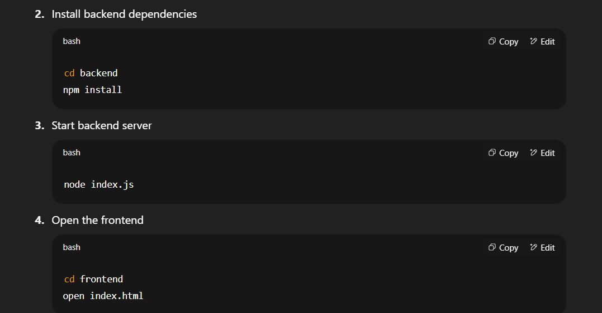
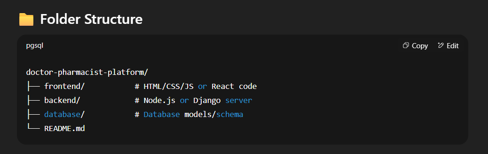

# 🩺 Doctor-Pharmacist Collaboration Platform

A full-stack web application designed to reduce medical errors caused by miscommunication between doctors and pharmacists. This platform allows doctors to create digital prescriptions and enables pharmacists to view, verify, and communicate in real-time.

## 📌 Problem Statement
Due to handwritten prescriptions and lack of direct communication, pharmacists often misinterpret doctors' instructions—leading to serious medical issues or even fatalities. This project solves that problem with a secure, digital platform.

## 🚀 Features
- Role-based login for doctors and pharmacists  
- Doctors can create digital prescriptions  
- Pharmacists can view and verify prescriptions  
- Real-time chat between doctor and pharmacist  
- Prescription history tracking  

## 🔧 Tech Stack

**Frontend:**  
- HTML, CSS, JavaScript  
- Bootstrap  
- *(React optional)*

**Backend:**  
- Node.js with Express *(or Django if you used it)*

**Database:**  
- MongoDB *(or SQLite/MySQL depending on your use)*

## 🖥️ How to Run Locally

1. Clone the repository
   ```bash
   git clone https://github.com/devangsoni2404/De-project.git
   cd De-project



